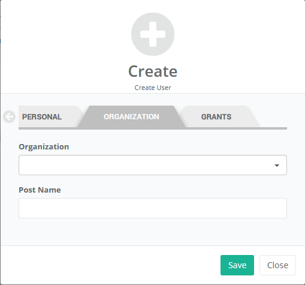
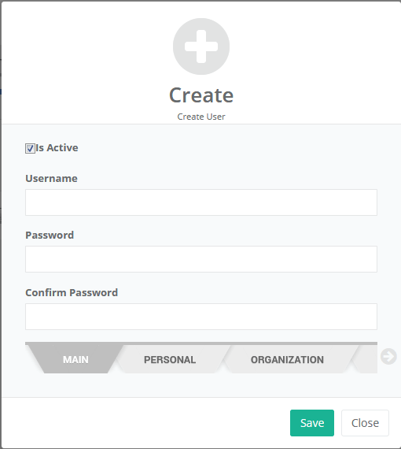

# Shadowed Tabs

A tabs widget for Yii Framework 2.

## Thanks

Thanks to Hemn Chawroka  <https://github.com/iprodev> for Modern Tabs Design.

## Screenshots

 


## Installation

The preferred way to install this extension is through [composer](http://getcomposer.org/download/).

Either run

```
$ php composer.phar require delikates-nsk/yii2-shadowed-tabs "@dev"
```

or add

```
"delikates-nsk/yii2-shadowed-tabs": "@dev"
```

to the ```require``` section of your `composer.json` file and run

```
$ php composer.phar update
```

## Usage

```php

<?php

use delikatesnsk\shadowedtabs\ShadowedTabsWidget;

echo ShadowedTabsWidget::widget([

    //id of container (ATTENTION! Required if you have more than one ShadowedTabsWidget at page!)
    'id' => 'tabsList', 

    //skin, see list of available skins at `ShadowedTabsWidget.php`
    'skin' => 'skin-asbestos',

    //Tabs position, POS_TOP (default) or POS_BOTTOM
    'position' => ShadowedTabsWidget::POS_BOTTOM,

    //array with options for arrows of scrolling tabs area 
    //'scroll' => 
    // [
    //  'visible' => true|false|'auto' //show/hide scrolling arrows, default 'auto'
    //  //javascript callback function that will be runned before area of tabs will be scrolled
    //  'before' => ' 
    //    function(direction, tabs) {
    //       console.log( direction ); //'right' or 'left'
    //       //tabs is array of all tabs
    //       tabs.forEach(function(tab){
    //           console.log( tab.id );
    //           console.log( tab.index );
    //           console.log( tab.visible );
    //           console.log( tab.label );
    //           console.log( tab.selected );
    //           console.log( tab.content );
    //       });
    //    }',
    //   'after' => '', //javascript callback function that will be runned after tabs area scrolled
    //    function(direction, tabs) {
    //       ... see example on 'before'
    //    }
    // ]

    //global ajax request to get content for choosed tab
    'ajax' => [
        'url' => '/getTabContent/', //url for ajax request
        'method' => 'get', //send method - 'post' or 'get', default `post`
        'showIndicator' => true, //show/hide ajax loading indicator
        'params' => [
            'param1' => 'value1',  // <-- Your additional params (if you need)
            'selTabId' => '%tabId' // <-- %tabId will be replaced to id of selected tab,
                                   // you can change `selTabId` key to any other, default key is `id`
        ],
    ],
    //list of tabs, array of array
    'tabs' => [
        [
            'id' => 'tabMain', //tab id, if not specified will be named as `tabN`, where N is index of tab in tab's list
            'label' => \Yii::t('app', 'Main'), //tab label
            'selected' => true, //when true, tab will be selected. Only one tab can be selected! By default first tab is selected always.
            'content' => $this->render('_tabMain', ['form' => $form, 'model' => $model]), //content that will be shown when you select a tab
        ],
        [
            'id' => 'tabPersonal', //tab id
            'label' => \Yii::t('app', 'Personal'), //tab label
            'content' => $this->render('_tabPersonal', ['form' => $form, 'model' => $model]), //content that will be shown when you select a tab
        ],
        [
            'id' => 'tabOrganization', //tab id
            'label' => \Yii::t('app', 'Organization'), //tab label
            'content' => $this->render('_tabOrganization', ['form' => $form, 'model' => $model]), //content that will be shown when you select a tab
        ],
        [
            'id' => 'tabGrants', //tab id
            'label' =>\Yii::t('app', 'Grants'), //tab label
            'content' => '',//$this->render('_tabGrants', ['form' => $form, 'model' => $model]), //content that will be shown when you select a tab
            //ajax-request for get tab content, overwrite global ajax!
            'ajax' => [
                'url' => '/getTabGrantsContent/', //url for ajax request
                'method' => 'post', //send method - 'post' or 'get', default 'post'
                'showIndicator' => true, //show/hide loading indicator
                'params' => [
                    'param1' => 'value1',  // <-- Your additional params (if you need)
                    'param2' => 'value1',
                    'param3' => 'value1',
                    'tab_id' => '%tabId' // <-- %tabId will be replaced to id of selected tab,
                                         // you can change 'tab_id' key to any other, default key is 'id'
                ],
    //          //javascript callback function that will be runned before ajax-request will be send
    //          'before' => ' 
    //                  function(tab) {
    //                      console.log( tab.id );
    //                      console.log( tab.index );
    //                      console.log( tab.visible );
    //                      console.log( tab.label );
    //                      console.log( tab.selected );
    //                      console.log( tab.content );
    //                  }',
    //          'after' => '', //javascript callback function that will be runned after ajax-request will be send, and SUCCESSFULLY answer will be received
    //                  function(tab) {
    //                      console.log( tab.id );
    //                      console.log( tab.index );
    //                      console.log( tab.visible );
    //                      console.log( tab.label );
    //                      console.log( tab.selected );
    //                      console.log( tab.content );
    //                  }
        ],
    ]
]);
```